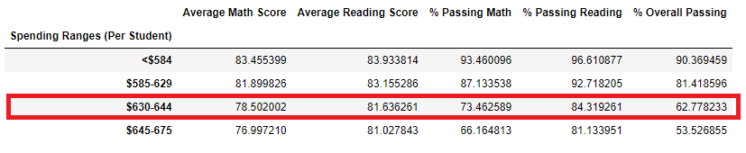
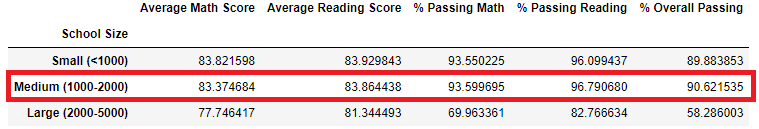
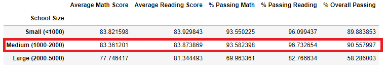

# Overview

# Results

- ### How is the district summary affected?

    Removing the ninth grade math and reading scores had minimal impact on the district summary.  Average scores and passing percentages _decreased_ by less than one point.

    

- ### How is the school summary affected?

    Thomas High School passing percentages were dramatically affected by removing 9th grade math and reading scores.

    ###### before and after
    
    

    However, after recalculating percentages with only 10-12 graders and replacing the summary percentages for Thomas High School, only a small decrease was realized.  For example, the overall passing percentage was recalculated using only the 10th-12th graders total instead of 9th-12th total.    

    ```python
    thomas_students_df = complete_df[(complete_df.school_name == "Thomas High School")]
    new_thomas_count = len(thomas_students_df) - thomas_9_grader_count
    ths_overall_passing_percentage = ths_passing_math_reading_count / new_thomas_count * 100
    ```

    Then we replaced the summary dataframe with Thomas High School new overall percentage.

    ```python
    per_school_summary_df.loc["Thomas High School", "% Overall Passing"] = ths_overall_passing_percentage
    ```

    ###### before and after
    
    

- ### How does replacing the ninth graders’ math and reading scores affect Thomas High School’s performance relative to the other schools?

    The 9th grade scores were replaced; however, the new percentages and averages did not include the ninth graders' math and reading scores.  Averages and percentages remained roughly the same despite removing the 9th grade class and therefore did not impact performance relative to the other schools.  Thomas High School remained the #2 performing school in the study.

    - Avg math score: `83.41` to `83.35`
    - Avg reading score: `83.84` to `83.89`
    - Pass math %: `93.27` to `93.18`
    - Pass reading %: `97.30` to `97.01`
    ###### before
    

    ###### after
    

- ### How does replacing the ninth-grade scores affect the following:

    Scores by school spend, school size, and school type were not impacted by removing the ninth-grade scores.

    - #### Math and reading scores by grade

    - #### Scores by school spending
    
            Note: when the dataframe is formatted, all numbers remained the same

        ###### before and after
        
        

    - #### Scores by school size

        The ninth graders were included in the total student count but only the 10-12th grader scores were used for averages and percentages.  Thomas High School remained a medium sized school and the scores were not affected.

            Note: when the dataframe is formatted, all numbers remained the same

        ###### before and after
        
        

    - #### Scores by school type

            Note: when the dataframe is formatted, all numbers remained the same

        ###### before and after
        
        

# Summary